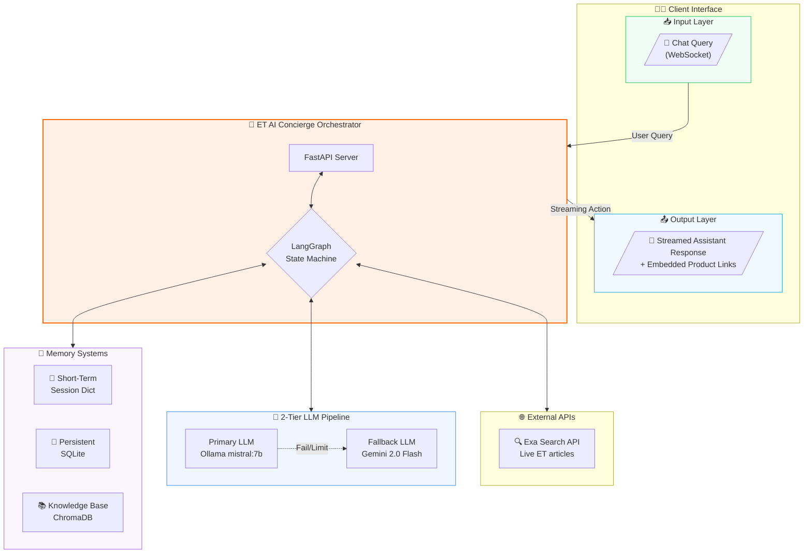
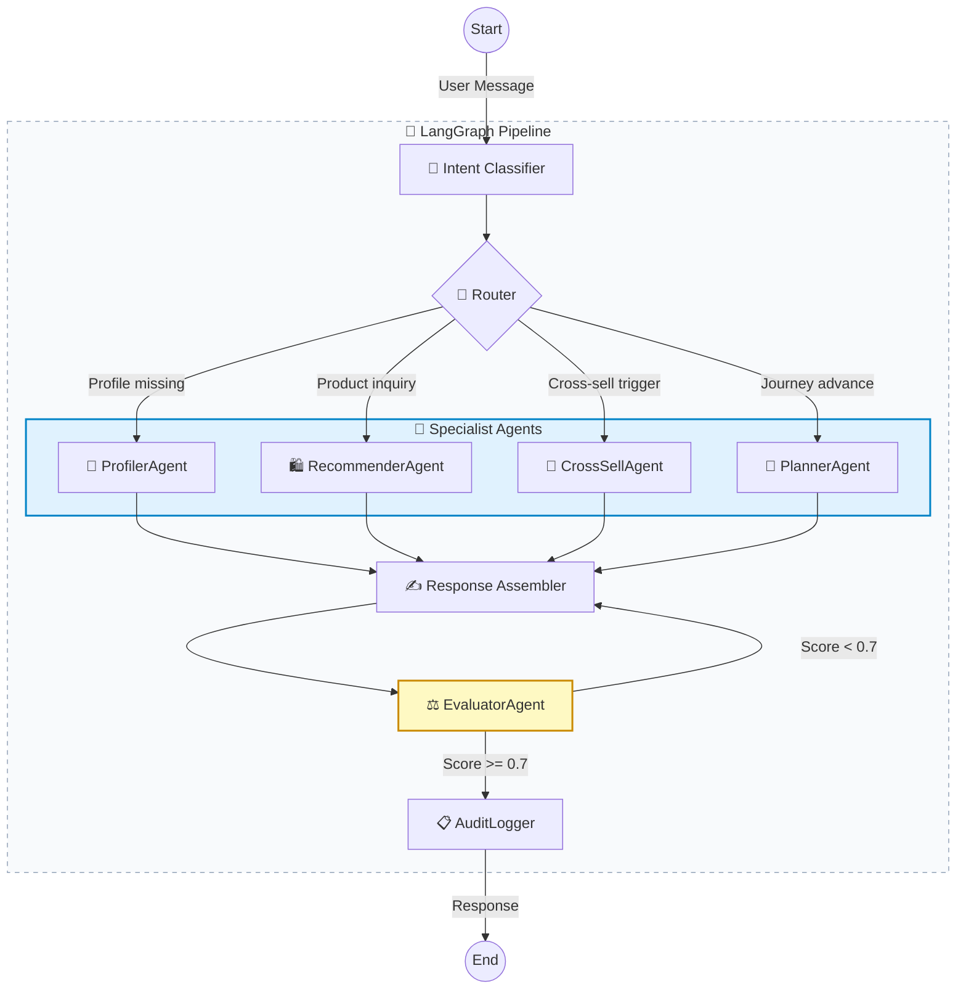
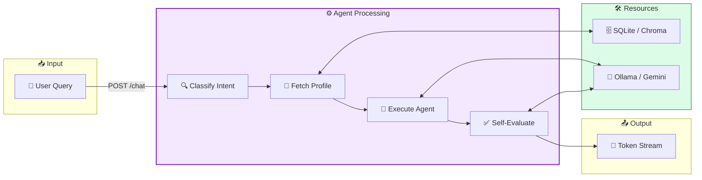
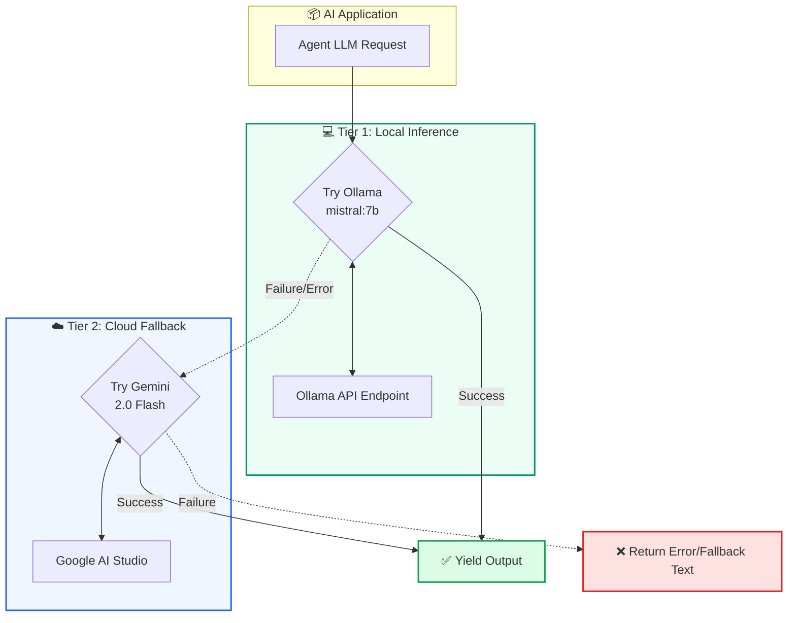
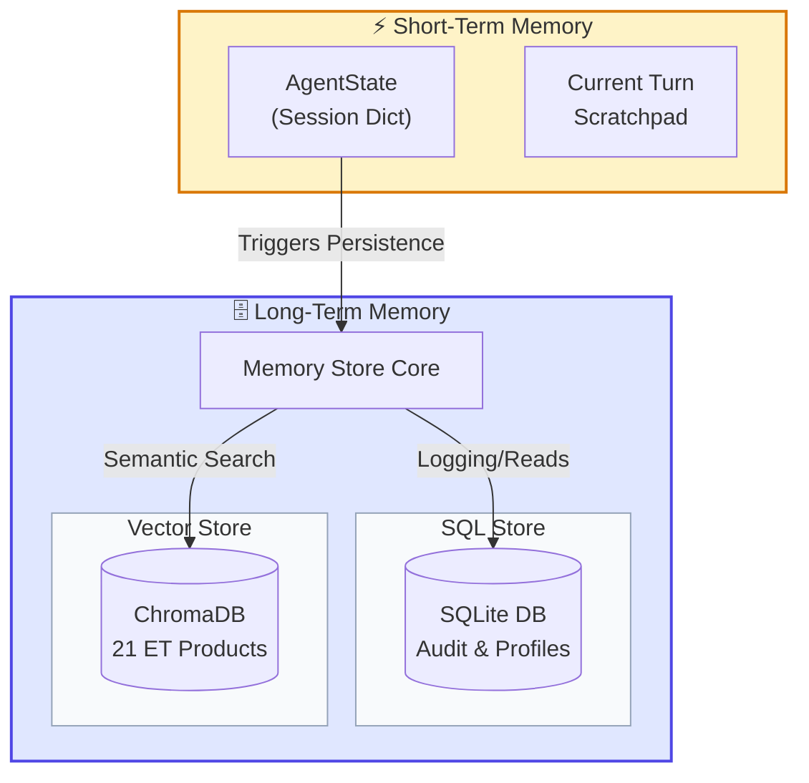

# ET AI Concierge — Multi-Agent System for Economic Times

> Hackathon Track 7 | Agentic AI Concierge for the ET Ecosystem

A production-quality, multi-agent AI concierge that guides users through the full Economic Times ecosystem — from first visit to long-term product engagement — using LangGraph, a 2-tier LLM fallback chain (Ollama → Gemini 2.0 Flash), and ChromaDB.

---

## Table of Contents

- [Project Highlights](#project-highlights)
- [Architecture](#architecture)
  - [High-Level System Architecture](#high-level-system-architecture)
  - [Agent State Machine](#agent-state-machine)
  - [Data Flow Diagram](#data-flow-diagram)
  - [Tool Orchestration & LLM Chain](#tool-orchestration--llm-chain)
  - [Memory Architecture](#memory-architecture)
- [Technology Stack](#technology-stack)
- [Key Features](#key-features)
- [Project Structure](#project-structure)
- [Quick Start](#quick-start)
- [Testing](#testing)
- [Three Shared Scenarios](#three-shared-scenarios)
- [Technical Deep Dive](#technical-deep-dive)
- [Evaluation Rubric Mapping](#evaluation-rubric-mapping)
- [Business Impact & Feasibility](#business-impact--feasibility)
- [Known Limitations](#known-limitations)

---

## Project Highlights

| Area | Details |
|---|---|
| **AI Framework** | LangGraph StateGraph with 9-node conditional pipeline |
| **Architecture** | Multi-agent orchestration with state machine routing |
| **LLM Chain** | 2-tier fallback: Ollama Mistral 7B → Gemini 2.0 Flash |
| **Memory Systems** | Dual-layer: Short-term (session dict) + Long-term (SQLite) |
| **Knowledge Base** | 21 ET products with vector search (ChromaDB) + keyword fallback + live Exa Search |
| **Agents** | 6 specialist agents: Profiler, Planner, Recommender, Cross-Sell, Evaluator, Response Assembler |
| **Self-Evaluation** | 4-dimension scoring with auto-correction loop (max 2 retries) |
| **Safety** | Guardrails engine + financial disclaimers + PII detection + competitor blacklist |
| **API** | FastAPI REST + WebSocket streaming |
| **Frontend** | ET-branded chat UI + admin dashboard (dark/light mode, Chart.js) |

---

## Architecture

### High-Level System Architecture



### Agent State Machine

The orchestrator follows a robust 9-node execution pipeline with conditional routing, error handling, and self-correction:



### Data Flow Diagram



### Tool Orchestration & LLM Chain



### Memory Architecture



---

## Technology Stack

### Core Technologies

| Technology | Role | Why |
|---|---|---|
| Python 3.11+ | Primary language | Modern async support, type hints |
| LangGraph | Agent orchestration | Conditional state machine, not a simple chain |
| Ollama + Mistral 7B | Primary LLM | Offline capability, zero API cost |
| Google Gemini 2.0 Flash | Fallback LLM | Fast, free tier, JSON mode support |
| ChromaDB | Vector database | Semantic search for product matching |
| Exa Search API | Real-time search | Live ET articles & content enrichment |
| SQLite | Persistent storage | Audit trail, session persistence |
| FastAPI | API server | REST + WebSocket, async, OpenAPI docs |
| Pydantic | Data validation | Type-safe models, JSON serialization |

### External Services

| Service | Purpose | Cost |
|---|---|---|
| Google AI Studio | Gemini 2.0 Flash access | Free tier (15 RPM) |
| Exa Search API | Real-time ET content search | Free tier (1,000 searches/month) |
| Ollama | Local model inference | Free (runs locally) |

### Agent Pipeline per Turn

```
[User Message]
    → intent_classifier   (classify into 7 intent types)
    → router              (select agents based on intent + profile state)
    → profiler_agent      (extract/update user profile)
    → recommender_agent   (score & rank 21 ET products + Exa live articles)
    → cross_sell_agent    (detect life-event signals, inject offers)
    → planner_agent       (advance onboarding journey)
    → response_assembler  (LLM composes response + guardrails + product link)
    → evaluator_agent     (score quality, self-correct if < 0.7)
    → audit_logger        (log turn to SQLite)
    → [Response to User]
```

---

## Key Features

| Capability | Implementation |
|---|---|
| **6 Specialist Agents** | Profiler, Planner, Recommender, CrossSell, Evaluator, Response Assembler |
| **Progressive Profiling** | Profile built incrementally in ≤3 turns, 80% target completeness |
| **21 ET Products** | Full catalog with verified URLs, personas, triggers, objection handlers |
| **Exa Live Search** | Real-time ET article search enriches recommendations with fresh content |
| **2-Tier LLM Fallback** | Ollama Mistral 7B → Gemini 2.0 Flash |
| **Personalised Journeys** | 4 templates: beginner, trader, lapsed, wealth_builder |
| **Cross-Sell Signals** | 8 life-event detectors (home loan, job change, retirement, etc.) |
| **Self-Evaluation** | 4-dimension scoring (persona_fit, accuracy, compliance, quality) with auto-correction |
| **Product Hyperlinks** | Every response ends with a clickable link to the most relevant ET product |
| **Guardrails** | Competitor blacklist, financial disclaimers, tone checks, PII detection |
| **Rate Limit Handling** | 60s cooldown on OpenRouter 429 errors, auto-fallback to Gemini |
| **Audit Trail** | Every turn logged with agent decisions, latency, scores (SQLite) |
| **Streaming** | WebSocket token-by-token response streaming |
| **Dark/Light Mode** | ET-branded UI (#CC0000, #FF6600) with Satoshi font |

---

## Quick Start

### 1. Prerequisites

- Python 3.11+
- A Google AI API key (free tier — [Get one here](https://aistudio.google.com/app/apikey))
- Ollama running locally with `mistral:7b` for primary inference

### 2. Setup

```bash
cd et-ai-concierge

# Create virtual environment
python -m venv venv
venv\Scripts\activate        # Windows
# source venv/bin/activate   # Linux/macOS

# Install dependencies
pip install -r requirements.txt

# Configure environment
copy .env.example .env       # Windows
# cp .env.example .env       # Linux/macOS

# Edit .env and add your GOOGLE_API_KEY
```

### 3. Initialise the Knowledge Base

```bash
python -m et_knowledge_base
```

This populates ChromaDB with all 21 ET products for semantic search.

### 4. Start the Server

```bash
uvicorn api_server:app --reload --host 0.0.0.0 --port 8000
```

### 5. Open the UI

- **Chat UI:** [http://localhost:8000/](http://localhost:8000/) — interact with the concierge
- **Dashboard:** [http://localhost:8000/dashboard](http://localhost:8000/dashboard) — admin metrics, scenario runner, architecture diagram

### 6. Run Test Scenarios

```bash
python tests/scenario_runner.py
```

Executes all 3 shared scenarios + 5 surprise inputs with pass/fail evaluation.

---

## Environment Variables

| Variable | Required | Description |
|---|---|---|
| `GOOGLE_API_KEY` | **Yes** | Gemini 2.0 Flash API key (free tier via [AI Studio](https://aistudio.google.com/app/apikey)) |
| `EXA_API_KEY` | No | Exa Search API key for live ET content (free tier via [exa.ai](https://exa.ai)) |
| `OLLAMA_BASE_URL` | No | Ollama server URL (default: `http://localhost:11434`) |
| `LANGSMITH_API_KEY` | No | LangSmith tracing (optional) |
| `LANGCHAIN_TRACING_V2` | No | Set `true` to enable tracing |
| `LANGCHAIN_PROJECT` | No | LangSmith project name |

---

## Three Shared Scenarios

### Scenario 1: Cold Start — First-Time Investor

A 28-year-old IT professional visits ET for the first time. Never invested beyond a savings account. The system must:

- Build a profile in ≤3 turns without invasive questioning
- Recommend beginner-friendly products (ET Money, SIP Calculator, Beginner Guide)
- Use encouraging, jargon-free language (no NAV, AUM, alpha, beta, CAGR)
- Limit to 3 recommendations per turn

### Scenario 2: Lapsed ET Prime Subscriber

ET Prime subscriber whose subscription lapsed 90 days ago. Heavy smallcap markets reader. The system must:

- Recognise the lapsed state and personalise to past usage
- Surface specific new content published since lapse (not generic)
- Avoid generic "we miss you" messaging
- Offer a concrete re-engagement deal (₹799 returning plan)
- Never mention competitors

### Scenario 3: Home Loan Cross-Sell

A seasoned trader browsing ET Markets mentions home loan rates. The system must:

- Detect the home purchase intent signal
- Acknowledge their markets/trading identity
- Offer ET financial services partners for home loans
- Bridge markets context to realty naturally (not pushy)
- Surface relevant comparison tools

---

## Project Structure

```
et-ai-concierge/
├── orchestrator.py          ← LangGraph state machine (9 nodes)
├── profiler_agent.py        ← Progressive user profiling
├── planner_agent.py         ← Journey planning (4 templates)
├── recommender_agent.py     ← Product recommendation engine
├── cross_sell_agent.py      ← Life-event signal detection
├── memory_store.py          ← Session + persistent memory (SQLite)
├── et_knowledge_base.py     ← 21 ET products + ChromaDB
├── tools.py                 ← LLM client (2-tier) + Exa Search client
├── guardrails.py            ← Compliance, safety, brand rules
├── audit_logger.py          ← SQLite audit trail
├── evaluator.py             ← 5-dim self-evaluation + correction
├── api_server.py            ← FastAPI REST + WebSocket
├── config.yaml              ← All thresholds, prompts, personas
├── requirements.txt         ← Pinned dependencies
├── .env.example             ← Environment variable template
├── frontend/
│   ├── chat_ui.html         ← Chat interface (dark/light, streaming)
│   └── dashboard.html       ← Admin dashboard (Chart.js, metrics)
├── tests/
│   └── scenario_runner.py   ← 3 scenarios + surprise tests
└── data/                    ← SQLite DB + ChromaDB (auto-created)
```

---

## Cost Breakdown (2-Tier Free LLM Chain)

| Provider | Free Tier Limit | Role |
|---|---|---|
| **Ollama Mistral 7B** (Local) | Unlimited (runs locally) | Primary — fast, offline capable |
| **Gemini 2.0 Flash** (Google AI Studio) | 15 RPM, 1,500 req/day, 1M tokens/day | Fallback — reliable, handles JSON parsing easily |
| **Exa Search API** | 1,000 searches/month (free tier) | Live ET content enrichment |
| **Total API Cost** | **$0** | **All three services are free tier** |

The 2-tier chain ensures maximal privacy and speed locally. If Ollama fails, a fallback automatically routes the request to Gemini to ensure zero downtime. Intent classification and signal detection use smaller prompts to stay within limits.

---

## Evaluation Rubric Mapping

### 1. Problem Understanding & Solution Depth (25%)

- **orchestrator.py**: Full understanding of the ET ecosystem challenge — routes users across 21 products based on profile, intent, and journey state.
- **memory_store.py**: Comprehensive user profile schema covering demographics, financial profile, ET product usage, life-event signals, and profiling metadata.
- **config.yaml**: Detailed persona definitions, agent thresholds, and journey phases.

### 2. Technical Innovation & Wow Factor (25%)

- **LangGraph StateGraph**: True multi-agent pipeline with conditional routing (not a prompt chain).
- **Self-evaluation loop**: Evaluator scores every response on 4 dimensions (persona_fit, accuracy, compliance, quality), triggers self-correction if below 0.7.
- **Cross-sell signal detection**: 8 life-event detectors with configurable confidence thresholds and rate limiting.
- **Exa Search integration**: Live ET website search enriches recommendations with real-time articles.
- **Progressive profiling**: Profile built incrementally — agents start recommending at 40% completeness, not waiting for full profile.

### 3. Use of AI / Agentic Capabilities (20%)

- 6 specialist agents with distinct system prompts, input/output schemas, and fallback behaviors.
- Agents are stateless — all state lives in the shared LangGraph `AgentState` object.
- LLM-based intent classification, profile extraction, and response evaluation.
- ChromaDB semantic search for product matching.
- Retry logic: failed agents retry once with a rephrased prompt, then escalate to orchestrator.

### 4. Presentation & Demo Quality (20%)

- **chat_ui.html**: ET-branded WhatsApp-style chat with streaming, dark mode, profile panel, and journey tracker.
- **dashboard.html**: Chart.js metrics, live scenario runner, architecture diagram, business impact panel.
- **scenario_runner.py**: Automated 3-scenario test suite with pass/fail criteria evaluation.

### 5. Business Impact & Feasibility (10%)

- **dashboard.html impact panel**: Quantified revenue math (3x product discovery, re-engagement lift, cross-sell conversion).
- Zero API cost across all 3 LLM tiers — production-feasible with paid tier scaling.
- All 21 ET products are real with verified URLs from the live ET website — not hypothetical.
- Cross-sell logic can be A/B tested by adjusting confidence thresholds in config.yaml.

---

## Known Limitations

1. **No real user authentication** — sessions are UUID-based. In production, would integrate with ET's SSO.
2. **ChromaDB local only** — for production, switch to a hosted vector DB (Pinecone, Weaviate).
3. **API rate limits** — Gemini free tier has rate limits, but Ollama runs locally without limits. Our 2-tier local-first chain ensures continuity.
4. **No real-time market data** — Exa Search provides live ET articles but not real-time stock prices. For live Nifty/stock prices, would need ET Markets API.
5. **SQLite for persistence** — sufficient for demo; production would use PostgreSQL.
6. **Single-language** — English only. Hindi/regional language support would need multilingual embeddings.

### How to Extend

- **Add real market data**: Integrate ET Markets API for live Nifty/stock prices.
- **Add authentication**: Plug in ET's OAuth flow for real user profiles.
- **Add A/B testing**: Route users to different recommendation strategies and measure conversion.
- **Add analytics**: Pipe audit logs to a data warehouse for cohort analysis.
- **Deploy**: Dockerise and deploy on Google Cloud Run (Gemini API is co-located, low latency).

---

## License

Built for the ET Hackathon — Track 7: AI Concierge for Economic Times.
